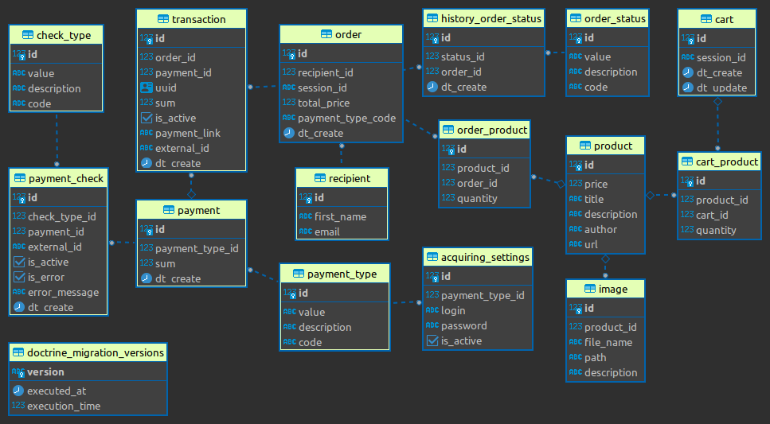

# Книжный магазин

### Функционал

- Наполнение магазина товаром;
- Наполнение корзины;
- Оформление заказа;
- Получение книг в электронном варианте на email через брокер сообщений;
- Возможность подключения эквайрингов;
- Возможность фискализации.

### Технологический стэк

- PHP 8.1
- PostgreSQL 13
- Symfony 6.0
- RabbitMQ 3.11.2

### Install

1. Запуск
```bash
docker-compose up
```
2. Зайти в контейнер
```bash
docker exec -it app sh
```
3. В контейнере установить зависимости
```bash
composer ins
```
4. Загрузить миграции
```bash
php bin/console doctrine:migrations:migrate
```
5. Загрузить фикстуры
```bash
php bin/console doctrine:fixtures:load
```
6. Запустить ворекры
```bash
php bin/console messenger:consume send_transaction
php bin/console messenger:consume send_order_completed
```
6. Зайти в swagger по адресу http://127.0.0.1/api/doc
7. *Для фискализации требуется включить command
```bash
php bin/console app:fiscal-check
```

### Схема БД



### PHPSTAN

1. Зайти в контейнер
```bash
docker exec -it app sh
```
2. Запустить phpstan
```bash
make phpstan
```

### PHPMD

1. Зайти в контейнер
```bash
docker exec -it app sh
```
2. Запустить phpstan
```bash
make phpmd
```

### PHPCS

1. Зайти в контейнер
```bash
docker exec -it app sh
```
2. Запустить phpcs
```bash
make phpcs
```

### Psalm

1. Зайти в контейнер
```bash
docker exec -it app sh
```
2. Запустить psalm
```bash
make psalm
```